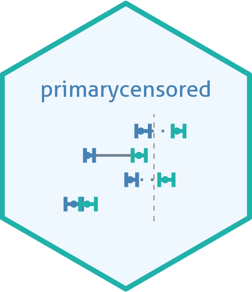

<!-- README.md is generated from README.Rmd. Please edit that file -->

```{r, include = FALSE}
knitr::opts_chunk$set(
  collapse = TRUE,
  comment = "",
  fig.path = file.path("man", "figures", "README-"),
  out.width = "100%",
  dpi = 330,
  message = FALSE, warning = FALSE
)
```
# Primary event censored distributions in R and Stan <a href="https://primarycensored.epinowcast.org/"></a>

<!-- badges: start -->
[](https://www.tidyverse.org/lifecycle/#experimental)
[](https://github.com/epinowcast/primarycensored/actions/workflows/R-CMD-check.yaml) [](https://app.codecov.io/gh/epinowcast/primarycensored)

[](https://epinowcast.r-universe.dev/primarycensored)
[](https://github.com/epinowcast/primarycensored/blob/master/LICENSE.md/)
[](https://github.com/epinowcast/primarycensored/graphs/contributors)

[](https://zenodo.org/doi/10.5281/zenodo.13632838)
<!-- badges: end -->

## Summary

```{r, results = "asis", echo=FALSE}
cat(gsub("\n[ ]+", " ", packageDescription("primarycensored")$Description))
```

## Installation

<details><summary>Installing the package</summary>

```{r, child="vignettes/chunks/_readme-install-primarycensored.Rmd"}
```

</details>

<details><summary>Installing CmdStan (optional for Stan functionality)</summary>

If you wish to use the Stan functions, you will need to install [CmdStan](https://mc-stan.org/users/interfaces/cmdstan), which also entails having a suitable C++ toolchain setup. We recommend using the [`cmdstanr` package](https://mc-stan.org/cmdstanr/). The Stan team provides instructions in the [_Getting started with
`cmdstanr`_](https://mc-stan.org/cmdstanr/articles/cmdstanr.html) vignette, with other details and support at the [package site](https://mc-stan.org/cmdstanr/) along with some key instructions available in the [Stan resources package vignette](https://package.epinowcast.org/articles/stan-help.html#toolchain), but the brief version is:

```{r, eval = FALSE}
# if you not yet installed `primarycensored`, or you installed it without
# `Suggests` dependencies
install.packages(
  "cmdstanr",
  repos = c("https://stan-dev.r-universe.dev", getOption("repos"))
)
# once `cmdstanr` is installed:
cmdstanr::install_cmdstan()
```

*Note: You can speed up CmdStan installation using the `cores` argument. If you are installing a particular version of `epinowcast`, you may also need to install a past version of CmdStan, which you can do with the `version` argument.*

</details>

## Resources

We provide a range of other documentation, case studies, and community spaces to ask (and answer!) questions:

<details><summary>Package Website</summary>

The [`primarycensored` website](https://primarycensored.epinowcast.org/) includes a function reference, model outline, and case studies using the package. The site mainly concerns the release version, but you can also find documentation for [the latest development version](https://primarycensored.epinowcast.org/dev/).

</details>

<details><summary>Vignettes</summary>

We have created [package vignettes](https://primarycensored.epinowcast.org/articles) to help you get started with primarycensored and to highlight other features with case studies.

</details>

<details><summary>Organisation Website</summary>

Our [organisation website](https://www.epinowcast.org/) includes links to other resources, [guest posts](https://www.epinowcast.org/blog.html), and [seminar schedule](https://www.epinowcast.org/seminars.html) for both upcoming and past recordings.

</details>

<details><summary>Community Forum</summary>

Our [community forum](https://community.epinowcast.org/) has areas for [question and answer](https://community.epinowcast.org/c/interface/15) and [considering new methods and tools](https://community.epinowcast.org/c/projects/11), among others. If you are generally interested in real-time analysis of infectious disease, you may find this useful even if you do not use `primarycensored`.

</details>

## Contributing

We welcome contributions and new contributors! We particularly appreciate help on [identifying and identified issues](https://github.com/epinowcast/primarycensored/issues). Please check and add to the issues, and/or add a [pull request](https://github.com/epinowcast/primarycensored/pulls) and see our [contributing guide](https://github.com/epinowcast/.github/blob/main/CONTRIBUTING.md) for more information.

If you need a different underlying model for your work: `primarycensored` provides a flexible framework for censored distributions in both R and Stan. If you implement new distributions or censoring mechanisms that expand the overall flexibility or improve the defaults, please let us know either here or on the [community forum](https://community.epinowcast.org/). We always like to hear about new use-cases and extensions to the package.

### How to make a bug report or feature request

Please briefly describe your problem and what output you expect in an [issue](https://github.com/epinowcast/primarycensored/issues). If you have a question, please don't open an issue. Instead, ask on our [Q and A page](https://github.com/epinowcast/primarycensored/discussions/categories/q-a). See our [contributing guide](https://github.com/epinowcast/.github/blob/main/CONTRIBUTING.md) for more information.

### Code of Conduct

Please note that the `primarycensored` project is released with a [Contributor Code of Conduct](https://github.com/epinowcast/.github/blob/main/CODE_OF_CONDUCT.md). By contributing to this project, you agree to abide by its terms.

## Citation

If making use of our methodology or the methodology on which ours is based, please cite the relevant papers from our [methods outline](https://primarycensored.epinowcast.org/articles/primarycensored.html). If you use `primarycensored` in your work, please consider citing it with `citation("primarycensored")`.

## Contributors


<!-- ALL-CONTRIBUTORS-LIST:START - Do not remove or modify this section -->
<!-- prettier-ignore-start -->
<!-- markdownlint-disable -->

All contributions to this project are gratefully acknowledged using the [`allcontributors` package](https://github.com/ropenscilabs/allcontributors) following the [all-contributors](https://allcontributors.org) specification. Contributions of any kind are welcome!

### Code


<a href="https://github.com/epinowcast/primarycensored/commits?author=seabbs">seabbs</a>,
<a href="https://github.com/epinowcast/primarycensored/commits?author=SamuelBrand1">SamuelBrand1</a>,
<a href="https://github.com/epinowcast/primarycensored/commits?author=athowes">athowes</a>,
<a href="https://github.com/epinowcast/primarycensored/commits?author=sbfnk">sbfnk</a>


### Issue Authors


<a href="https://github.com/epinowcast/primarycensored/issues?q=is%3Aissue+author%3Azsusswein">zsusswein</a>,
<a href="https://github.com/epinowcast/primarycensored/issues?q=is%3Aissue+author%3Ajcblemai">jcblemai</a>


### Issue Contributors


<a href="https://github.com/epinowcast/primarycensored/issues?q=is%3Aissue+commenter%3Aparksw3">parksw3</a>


<!-- markdownlint-enable -->
<!-- prettier-ignore-end -->
<!-- ALL-CONTRIBUTORS-LIST:END -->
