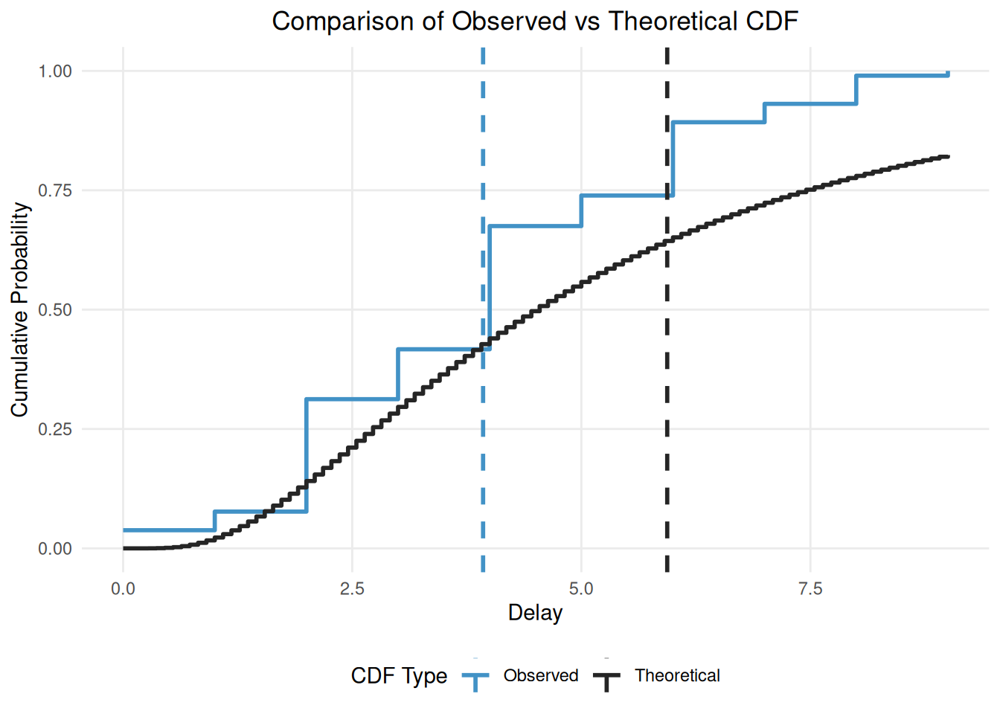

# Fitting distributions using primarycensored and cmdstan

## 1 Introduction

### 1.1 What are we going to do in this vignette

In this vignette, we’ll demonstrate how to use `primarycensored` in
conjunction with Stan for Bayesian inference of epidemiological delay
distributions. We’ll cover the following key points:

1.  Simulating censored delay distribution data
2.  Fitting a naive model using cmdstan
3.  Evaluating the naive model’s performance
4.  Fitting an improved model using `primarycensored` functionality
5.  Fitting the same model using `primarycensored`’s built in cmdstan
    model.
6.  Comparing the `primarycensored` model’s performance to the naive
    model

### 1.2 What you will learn

By the end of this vignette, you will be able to: - Understand the bias
introduced by ignoring primary censoring and truncation when fitting
delay distributions - Use
[`pcd_cmdstan_model()`](https://primarycensored.epinowcast.org/dev/reference/pcd_cmdstan_model.md)
and
[`pcd_as_stan_data()`](https://primarycensored.epinowcast.org/dev/reference/pcd_as_stan_data.md)
to fit distributions that properly account for primary censoring,
secondary censoring, and truncation - Understand when Bayesian fitting
with Stan is appropriate versus MLE approaches with fitdistrplus

### 1.3 What might I need to know before starting

This vignette builds on the concepts introduced in the [Getting Started
with
primarycensored](https://primarycensored.epinowcast.org/dev/articles/primarycensored.md)
vignette and assumes familiarity with using Stan tools as covered in the
[How to use primarycensored with
Stan](https://primarycensored.epinowcast.org/dev/articles/using-stan-tools.md)
vignette.

### 1.4 Packages used in this vignette

Alongside the `primarycensored` package we will use the `cmdstanr`
package for interfacing with cmdstan. We will also use the `ggplot2`
package for plotting and `dplyr` for data manipulation.

``` r
library(primarycensored)
library(cmdstanr)
library(ggplot2)
library(dplyr)
```

## 2 Simulating censored and truncated delay distribution data

We’ll start by simulating some censored and truncated delay distribution
data. We’ll use the `rprimarycensored` function (actually we will use
the `rpcens` alias for brevity).

``` r
set.seed(123) # For reproducibility

# Define the number of samples to generate
n <- 2000

# Define the true distribution parameters
meanlog <- 1.5
sdlog <- 0.75

# Generate varying pwindow, swindow, and obs_time lengths
pwindows <- sample.int(2, n, replace = TRUE)
swindows <- sample.int(2, n, replace = TRUE)
obs_times <- sample(8:10, n, replace = TRUE)

# Function to generate a single sample
generate_sample <- function(pwindow, swindow, obs_time) {
  rpcens(
    1, rlnorm,
    meanlog = meanlog, sdlog = sdlog,
    pwindow = pwindow, swindow = swindow, D = obs_time
  )
}

# Generate samples
samples <- mapply(generate_sample, pwindows, swindows, obs_times)

# Create initial data frame
delay_data <- data.frame(
  pwindow = pwindows,
  obs_time = obs_times,
  observed_delay = samples, # this is the observed i.e. censored delay
  observed_delay_upper = samples + swindows # The upper bound of the delay3
  # (i.e. the true delay is between the observed and the upper bound)
) |>
  mutate(
    observed_delay_upper = pmin(obs_time, observed_delay_upper)
  )

head(delay_data)
```

    ##   pwindow obs_time observed_delay observed_delay_upper
    ## 1       1        9              3                    4
    ## 2       1        9              4                    5
    ## 3       1        8              6                    7
    ## 4       2       10              6                    8
    ## 5       1       10              8                   10
    ## 6       2        8              4                    5

``` r
# Aggregate to unique combinations and count occurrences
delay_counts <- delay_data |>
  summarise(
    n = n(),
    .by = c(pwindow, obs_time, observed_delay, observed_delay_upper)
  )

head(delay_counts)
```

    ##   pwindow obs_time observed_delay observed_delay_upper  n
    ## 1       1        9              3                    4 37
    ## 2       1        9              4                    5 31
    ## 3       1        8              6                    7 16
    ## 4       2       10              6                    8 26
    ## 5       1       10              8                   10 22
    ## 6       2        8              4                    5 43

``` r
# Compare the samples with and without secondary event censoring to the true
# distribution
# Calculate empirical CDF
empirical_cdf <- ecdf(samples)

# Create a sequence of x values for the theoretical CDF
x_seq <- seq(min(samples), max(samples), length.out = 100)

# Calculate theoretical CDF
theoretical_cdf <- plnorm(x_seq, meanlog = meanlog, sdlog = sdlog)

# Create a long format data frame for plotting
cdf_data <- data.frame(
  x = rep(x_seq, 2),
  probability = c(empirical_cdf(x_seq), theoretical_cdf),
  type = rep(c("Observed", "Theoretical"), each = length(x_seq)),
  stringsAsFactors = FALSE
)

# Plot
ggplot(cdf_data, aes(x = x, y = probability, color = type)) +
  geom_step(linewidth = 1) +
  scale_color_manual(
    values = c(Observed = "#4292C6", Theoretical = "#252525")
  ) +
  geom_vline(
    aes(xintercept = mean(samples), color = "Observed"),
    linetype = "dashed", linewidth = 1
  ) +
  geom_vline(
    aes(xintercept = exp(meanlog + sdlog^2 / 2), color = "Theoretical"),
    linetype = "dashed", linewidth = 1
  ) +
  labs(
    title = "Comparison of Observed vs Theoretical CDF",
    x = "Delay",
    y = "Cumulative Probability",
    color = "CDF Type"
  ) +
  theme_minimal() +
  theme(
    panel.grid.minor = element_blank(),
    plot.title = element_text(hjust = 0.5),
    legend.position = "bottom"
  )
```



In this figure you can see the impact of truncation and censoring as the
observed distribution has a much lower mean (the vertical dashed blue
line) than the true/theoretical distribution (the vertical dashed black
line). Our modelling aim is to recover the true parameters of the
theoretical distribution from the observed distribution (i.e. recover
the black lines from the blue lines).

We’ve aggregated the data to unique combinations of `pwindow`,
`swindow`, and `obs_time` and counted the number of occurrences of each
`observed_delay` for each combination. This is the data we will use to
fit our model.

## 3 Fitting a naive model using cmdstan

We’ll start by fitting a naive model using cmdstan. We’ll use the
`cmdstanr` package to interface with cmdstan. We define the model in a
string and then write it to a file as in the [How to use primarycensored
with
Stan](https://primarycensored.epinowcast.org/dev/articles/using-stan-tools.md)
vignette.

``` r
writeLines(
  "data {
    int<lower=0> N;  // number of observations
    vector[N] y;     // observed delays
    vector[N] n;     // number of occurrences for each delay
  }
  parameters {
    real mu;
    real<lower=0> sigma;
  }
  model {
    // Priors
    mu ~ normal(1, 1);
    sigma ~ normal(0.5, 1);

    // Likelihood
    target += n .* lognormal_lpdf(y | mu, sigma);
  }",
  con = file.path(tempdir(), "naive_lognormal.stan")
)
```

Now let’s compile the model

``` r
naive_model <- cmdstan_model(file.path(tempdir(), "naive_lognormal.stan"))
```

and now let’s fit the compiled model.

``` r
naive_fit <- naive_model$sample(
  data = list(
    # Add a small constant to avoid log(0)
    y = delay_counts$observed_delay + 1e-6,
    n = delay_counts$n,
    N = nrow(delay_counts)
  ),
  chains = 4,
  parallel_chains = 4,
  refresh = ifelse(interactive(), 50, 0),
  show_messages = interactive()
)
naive_fit
```

    ##  variable       mean     median   sd  mad         q5        q95 rhat ess_bulk
    ##     lp__  -381721.38 -381721.10 0.99 0.76 -381723.44 -381720.42 1.00     1817
    ##     mu         -0.60      -0.60 0.01 0.01      -0.62      -0.58 1.00     1601
    ##     sigma       5.10       5.10 0.01 0.01       5.08       5.11 1.00     3935
    ##  ess_tail
    ##      2101
    ##      1882
    ##      2752

You may see a warning that `NAs introduced by coercion` this can be
ignored as it is an artefact of this simple example model.

We see that the model has converged and the diagnostics look good.
However, just from the model posterior summary we see that we might not
be very happy with the fit. `mu` is smaller than the target 1.5 and
`sigma` is larger than the target 0.75. **Note that the `mu` and `sigma`
parameters are the meanlog and sdlog parameters of the lognormal
distribution.**

## 4 Fitting an improved model using primarycensored

We’ll now fit an improved model using the `primarycensored` package. The
main improvement is that we will use the `primarycensored_lpdf` function
to fit the model. This is the Stan version of the `pcens()` function and
adjusts for the primary and secondary censoring windows as well as the
truncation. We encode that our primary distribution is a lognormal
distribution by passing 1 as the `dist_id` parameter and that our
primary event distribution is uniform by passing 1 as the `primary_id`
parameter. See the [Stan
documentation](https://primarycensored.epinowcast.org/stan/primary__censored__dist_8stan.html#acc97240dee1bc19e4f02013118f3857d)
for more details on the `primarycensored_lpdf` function.

``` r
writeLines(
  "
  functions {
    #include primarycensored.stan
    // These functions are required for the primarycensored_lpdf function
    #include primarycensored_ode.stan
    #include primarycensored_analytical_cdf.stan
    #include expgrowth.stan
  }
  data {
    int<lower=0> N;  // number of observations
    array[N] int<lower=0> y;     // observed delays
    array[N] int<lower=0> y_upper;     // observed delays upper bound
    array[N] int<lower=0> n;     // number of occurrences for each delay
    array[N] int<lower=0> pwindow; // primary censoring window
    array[N] int<lower=0> D; // maximum delay
  }
  transformed data {
    array[0] real primary_params;
  }
  parameters {
    real mu;
    real<lower=0> sigma;
  }
  model {
    // Priors
    mu ~ normal(1, 1);
    sigma ~ normal(0.5, 0.5);

    // Likelihood
    for (i in 1:N) {
      target += n[i] * primarycensored_lpmf(
        y[i] | 1, {mu, sigma},
        pwindow[i], y_upper[i], D[i],
        1, primary_params
      );
    }
  }",
  con = file.path(tempdir(), "primarycensored_lognormal.stan")
)
```

Now let’s compile the model

``` r
primarycensored_model <- cmdstan_model(
  file.path(tempdir(), "primarycensored_lognormal.stan"),
  include_paths = pcd_stan_path()
)
```

Now let’s fit the compiled model.

``` r
primarycensored_fit <- primarycensored_model$sample(
  data = list(
    y = delay_counts$observed_delay,
    y_upper = delay_counts$observed_delay_upper,
    n = delay_counts$n,
    pwindow = delay_counts$pwindow,
    D = delay_counts$obs_time,
    N = nrow(delay_counts)
  ),
  chains = 4,
  parallel_chains = 4,
  refresh = ifelse(interactive(), 50, 0),
  show_messages = interactive()
)
primarycensored_fit
```

    ##  variable     mean   median   sd  mad       q5      q95 rhat ess_bulk ess_tail
    ##     lp__  -3422.81 -3422.47 1.09 0.75 -3424.97 -3421.80 1.00     1316     1453
    ##     mu        1.55     1.54 0.05 0.05     1.47     1.63 1.01     1072     1211
    ##     sigma     0.78     0.78 0.03 0.03     0.73     0.84 1.01     1121     1281

We see that the model has converged and the diagnostics look good. We
also see that the posterior means are very near the true parameters and
the 90% credible intervals include the true parameters.

## 5 Using `pcd_cmdstan_model()` for a more efficient approach

While the previous approach works well, `primarycensored` provides a
more efficient and convenient model which we can compile using
[`pcd_cmdstan_model()`](https://primarycensored.epinowcast.org/dev/reference/pcd_cmdstan_model.md).
This approach not only saves time in model specification but also
leverages within chain parallelisation to make best use of your
machine’s resources. Alongside this we also supply a convenience
function
[`pcd_as_stan_data()`](https://primarycensored.epinowcast.org/dev/reference/pcd_as_stan_data.md)
to convert our data into a format that can be used to fit the model and
supply priors, bounds, and other settings.

Let’s use this function to fit our data:

``` r
# Compile the model with multithreading support
pcd_model <- pcd_cmdstan_model(cpp_options = list(stan_threads = TRUE))

pcd_data <- pcd_as_stan_data(
  delay_counts,
  delay = "observed_delay",
  delay_upper = "observed_delay_upper",
  relative_obs_time = "obs_time",
  dist_id = pcd_stan_dist_id("lognormal", "delay"),
  primary_id = pcd_stan_dist_id("uniform", "primary"),
  param_bounds = list(lower = c(-Inf, 0), upper = c(Inf, Inf)),
  primary_param_bounds = list(lower = numeric(0), upper = numeric(0)),
  priors = list(location = c(1, 0.5), scale = c(1, 0.5)),
  primary_priors = list(location = numeric(0), scale = numeric(0)),
  use_reduce_sum = TRUE # use within chain parallelisation
)

pcd_fit <- pcd_model$sample(
  data = pcd_data,
  chains = 4,
  parallel_chains = 2, # Run 2 chains in parallel
  threads_per_chain = 2, # Use 2 cores per chain
  refresh = ifelse(interactive(), 50, 0),
  show_messages = interactive()
)

pcd_fit
```

    ##   variable     mean   median   sd  mad       q5      q95 rhat ess_bulk ess_tail
    ##  lp__      -3422.77 -3422.44 1.01 0.73 -3424.78 -3421.80 1.00     1295     1764
    ##  params[1]     1.54     1.54 0.05 0.04     1.47     1.62 1.00     1195     1379
    ##  params[2]     0.78     0.78 0.03 0.03     0.73     0.83 1.00     1177     1197

In this model we have a generic `params` vector that contains the
parameters for the delay distribution. In this case these are `mu` and
`sigma` from the last example (i.e. the meanlog and sdlog parameters of
the lognormal distribution). We also have a `primary_params` vector that
contains the parameters for the primary distribution. In this case this
is empty as we are using a uniform distribution.

We see again that the model has converged and the diagnostics look good.
We also see that the posterior means are very near the true parameters
and the 90% credible intervals include the true parameters as with the
manually written model. **Note that we have set `parallel_chains = 2`
and `threads_per_chain = 2` to demonstrate within chain parallelisation.
Usually however you would want to use
`parallel_chains = <number of chains>` and then use the remainder of the
available cores for within chain parallelisation by setting
`threads_per_chain = <remaining cores / number of chains>` to ensure
that you make best use of your machine’s resources.**

### 5.1 Summary

In this vignette we have shown how to fit a delay distribution using
`primarycensored` in conjunction with `cmdstan`. The key takeaways are:

- **Use
  [`pcd_cmdstan_model()`](https://primarycensored.epinowcast.org/dev/reference/pcd_cmdstan_model.md)
  and
  [`pcd_as_stan_data()`](https://primarycensored.epinowcast.org/dev/reference/pcd_as_stan_data.md)**:
  This is the recommended approach for most users. It handles all the
  complexity of primary censoring, secondary censoring, and truncation
  automatically, and supports within-chain parallelisation.
- **Specify distributions by ID**: Use
  [`pcd_stan_dist_id()`](https://primarycensored.epinowcast.org/dev/reference/pcd_stan_dist_id.md)
  to get the correct distribution identifier (e.g., `"lognormal"`,
  `"gamma"`, `"weibull"`).
- **Ignoring censoring causes bias**: The naive model that ignores
  primary censoring and truncation substantially underestimates the true
  distribution parameters.

For a faster MLE-based approach that doesn’t require Stan, see the
[`vignette("fitting-dists-with-fitdistrplus")`](https://primarycensored.epinowcast.org/dev/articles/fitting-dists-with-fitdistrplus.md)
vignette. For more flexible delay distribution fitting, see the
[`epidist`](https://epidist.epinowcast.org) package (which uses
`primarycensored` under the hood).

### 5.2 How you might adapt this vignette

This vignette uses simulated data, but you can adapt it for your own
work:

- **Replace simulation with real data**: Swap out the simulated
  `delay_data` with your own observations of delays between primary and
  secondary events
- **Change the distribution**: Replace `"lognormal"` with other
  distributions like `"gamma"` or `"weibull"` using
  [`pcd_stan_dist_id()`](https://primarycensored.epinowcast.org/dev/reference/pcd_stan_dist_id.md)
- **Vary the censoring windows**: Adjust `pwindow` values to match your
  data’s actual primary censoring intervals
- **Handle different truncation times**: Use varying values in the
  `obs_time` column if your observations have different maximum
  observable delays
- **Modify priors**: Adjust the `priors` argument in
  [`pcd_as_stan_data()`](https://primarycensored.epinowcast.org/dev/reference/pcd_as_stan_data.md)
  to reflect your prior knowledge about the distribution parameters
