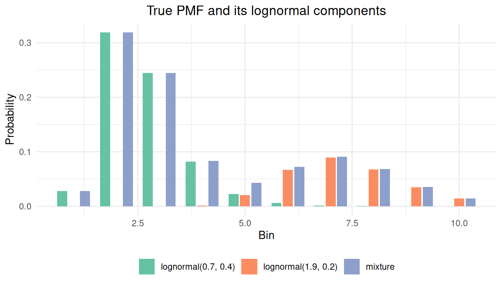
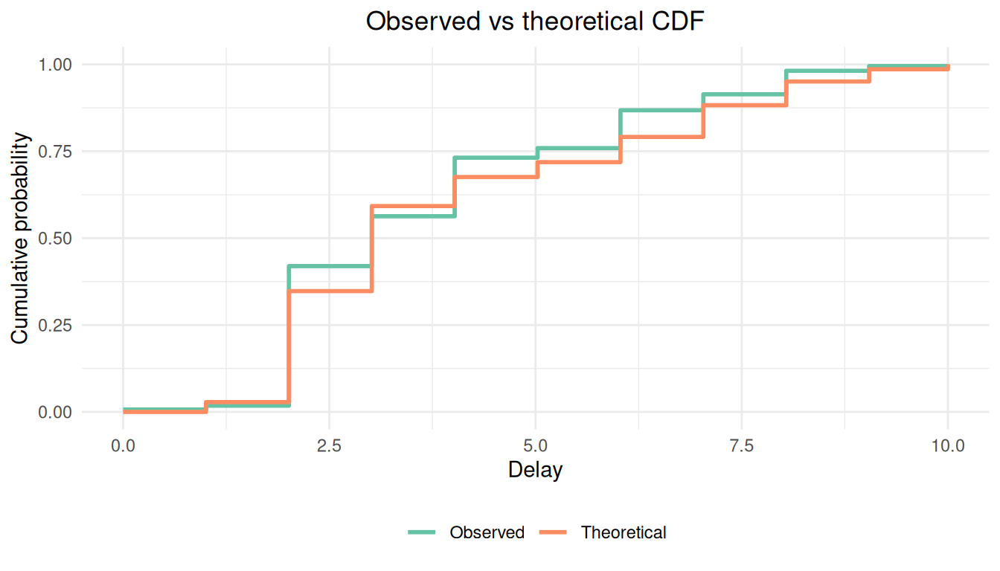
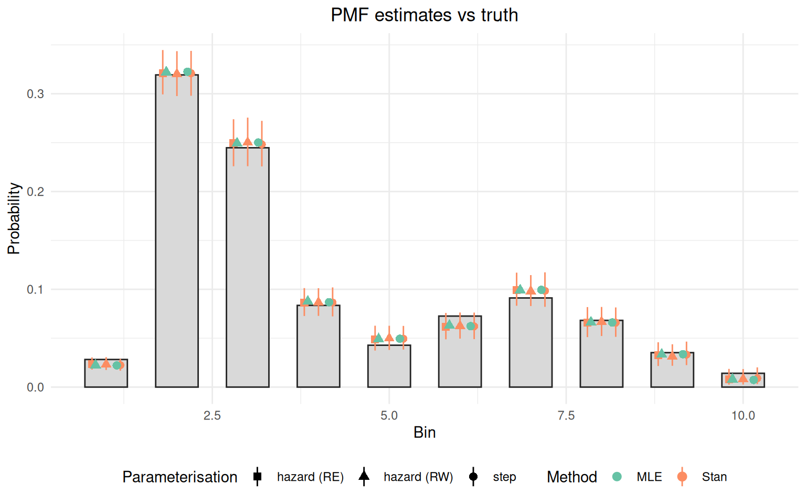

# Fitting non-parametric delay distributions

## 1 Introduction

### 1.1 What we will do

In this vignette we fit a non-parametric delay distribution to doubly
censored data using `primarycensored`. We discretise a mixture of two
lognormals onto integer bins to obtain a bimodal PMF, then simulate from
that distribution under primary and secondary censoring with
right-truncation, fit it with MLE via
[`fitdistdoublecens()`](https://primarycensored.epinowcast.org/dev/reference/fitdistdoublecens.md)
and with Stan via the package model exposed by
[`pcd_cmdstan_model()`](https://primarycensored.epinowcast.org/dev/reference/pcd_cmdstan_model.md),
then compare the four estimates against the truth. By the end you should
be able to recognise when a non-parametric fit is appropriate and
reproduce the workflow on your own data.

### 1.2 What you might want to read first

This vignette assumes familiarity with
[`vignette("fitting-dists-with-fitdistrplus")`](https://primarycensored.epinowcast.org/dev/articles/fitting-dists-with-fitdistrplus.md)
and
[`vignette("fitting-dists-with-stan")`](https://primarycensored.epinowcast.org/dev/articles/fitting-dists-with-stan.md).
Mathematical derivations of the censored convolution are in
[`vignette("why-it-works")`](https://primarycensored.epinowcast.org/dev/articles/why-it-works.md)
and
[`vignette("analytic-solutions")`](https://primarycensored.epinowcast.org/dev/articles/analytic-solutions.md).

### 1.3 Packages used in this vignette

Alongside `primarycensored` we use `cmdstanr` for Stan fitting,
`ggplot2` for plotting, and `dplyr` for data manipulation. MLE fitting
goes through
[`fitdistdoublecens()`](https://primarycensored.epinowcast.org/dev/reference/fitdistdoublecens.md)
(which calls `fitdistrplus`).

``` r

library(primarycensored)
library(cmdstanr) # nolint: unused_import_linter.
library(ggplot2)
library(dplyr)
```

## 2 Mathematical background

The non-parametric delay is supported on a fixed grid of \\K\\ bins with
boundaries \\b_0 \< b_1 \< \dots \< b_K\\. At the distribution level
(the R `d/p/r` functions and the corresponding Stan helpers) there is
one piecewise-constant CDF and two ways to write down the same step PMF.
[`pdiscretehazard()`](https://primarycensored.epinowcast.org/dev/reference/pdiscretehazard.md)
is a deterministic wrapper around
[`pdiscretestep()`](https://primarycensored.epinowcast.org/dev/reference/pdiscretestep.md):
it converts hazards to a PMF via
[`hazards_to_pmf()`](https://primarycensored.epinowcast.org/dev/reference/hazards_to_pmf.md)
and then delegates. The two parameterisations earn their keep at the
fitting stage, where they impose different regularisation on the PMF:
the simplex on the PMF treats the bins as exchangeable up to a prior,
the logit-hazard random walk assumes neighbouring hazards are related,
and the logit-hazard random effect assumes the hazards are exchangeable
around a common mean.

### 2.1 Discrete step (direct PMF)

We place a probability \\f_i\\ on each bin and require \\\sum\_{i=1}^{K}
f_i = 1\\ with \\f_i \geq 0\\. The CDF is the cumulative sum \\ F(t) =
\sum\_{i: b_i \leq t} f_i, \qquad t \in \[b_0, b_K\]. \\ Under right
truncation at \\D\\ and a censoring window \\\[d, d\_\text{upper}\]\\
the censored likelihood contribution for one observation is \\
\frac{F\_\text{obs}(d\_\text{upper}) -
F\_\text{obs}(d)}{F\_\text{obs}(D)}, \\ where \\F\_\text{obs}\\ is the
convolution of \\F\\ with the primary event density (see
[`vignette("why-it-works")`](https://primarycensored.epinowcast.org/dev/articles/why-it-works.md)
and
[`vignette("analytic-solutions")`](https://primarycensored.epinowcast.org/dev/articles/analytic-solutions.md)
for derivations). The natural prior is a Dirichlet on the simplex, \\f
\sim \text{Dirichlet}(\alpha)\\.

### 2.2 Discrete hazard — logit random walk

We instead model the discrete-time hazard \\h_i = \Pr(T \in \[b\_{i-1},
b_i) \mid T \geq b\_{i-1})\\ on the logit scale via a Gaussian random
walk. With innovations \\\varepsilon_j \sim \mathcal{N}(0, 1)\\, \\
\text{logit}(h_i) = \alpha + \sigma \sum\_{j=1}^{i-1} \varepsilon_j,
\qquad i = 1, \dots, K-1, \\ and \\h_K = 1\\ to make the PMF proper. The
PMF is recovered by \\ f_i = h_i \prod\_{j \< i} (1 - h_j). \\ The
random walk regularises towards smooth hazards: adjacent bins are tied
together through the cumulative sum.

### 2.3 Discrete hazard — logit random effect

The random-effect variant keeps the same logit-hazard transform but
drops the cumulative sum, treating the innovations as independent draws
around the intercept. With \\\varepsilon_i \sim \mathcal{N}(0, 1)\\, \\
\text{logit}(h_i) = \alpha + \sigma\\ \varepsilon_i, \qquad i = 1,
\dots, K-1, \\ and \\h_K = 1\\ again pins the final bin. The PMF is
recovered with the same product as the random walk. This
parameterisation assumes the hazards are exchangeable: it does not
borrow strength between neighbouring bins, only towards the common
intercept.

## 3 Simulating censored data from a step distribution

We build a bimodal true PMF as a mixture of two discretised lognormals,
one at days 2–3 and one at days 6–7. The mixture has two components,
`lognormal(meanlog = 0.7, sdlog = 0.4)` and
`lognormal(meanlog = 1.9, sdlog = 0.2)`, with mixing weights 0.7 and
0.3. A shape like this (for example a primary infection peak followed by
a secondary reporting bump) is awkward to capture with a single
parametric family and is a natural use case for the discrete step
distribution. Here a parametric mixture of two lognormals would also
work; this vignette shows the more general non-parametric approach.

``` r

set.seed(123)

K <- 10
boundaries <- 0:K

mode1 <- diff(plnorm(boundaries, meanlog = 0.7, sdlog = 0.4))
mode2 <- diff(plnorm(boundaries, meanlog = 1.9, sdlog = 0.2))
raw_pmf <- 0.7 * mode1 + 0.3 * mode2
true_pmf <- raw_pmf / sum(raw_pmf)
```

Before simulating we plot the two component PMFs together with the
resulting bimodal mixture, which makes the non-parametric motivation
visible.

``` r

truth_components <- data.frame(
  bin = rep(seq_len(K), 3),
  pmf = c(
    0.7 * mode1 / sum(raw_pmf),
    0.3 * mode2 / sum(raw_pmf),
    true_pmf
  ),
  series = factor(
    rep(
      c(
        "lognormal(0.7, 0.4)",
        "lognormal(1.9, 0.2)",
        "mixture"
      ),
      each = K
    ),
    levels = c(
      "lognormal(0.7, 0.4)",
      "lognormal(1.9, 0.2)",
      "mixture"
    )
  )
)

ggplot(truth_components, aes(x = bin, y = pmf, fill = series)) +
  geom_col(position = position_dodge(width = 0.8), width = 0.7) +
  scale_fill_brewer(palette = "Set2") +
  labs(
    x = "Bin", y = "Probability", fill = NULL,
    title = "True PMF and its lognormal components"
  ) +
  theme_minimal() +
  theme(
    legend.position = "bottom",
    plot.title = element_text(hjust = 0.5)
  )
```



We now simulate `n = 2000` doubly censored observations using
[`rpcens()`](https://primarycensored.epinowcast.org/dev/reference/rprimarycensored.md).
We let the primary window, the secondary window, and the
right-truncation point all vary across observations, mirroring the
convention used in
[`vignette("fitting-dists-with-stan")`](https://primarycensored.epinowcast.org/dev/articles/fitting-dists-with-stan.md).
A meaningful fraction of draws are right-truncated below the maximum
support; the fits must therefore correctly account for per-observation
truncation as well as for primary and secondary censoring. With
`n = 2000` the trough between the two modes is much better identified
than at `n = 500`; the recovered PMF is typically within `0.01` of the
truth in every bin.

``` r

n <- 2000
pwindows <- sample(c(1, 2), n, replace = TRUE)
swindows <- sample(c(1, 2), n, replace = TRUE)
obs_times <- sample(c(8, 10, 11), n, replace = TRUE)

generate_sample <- function(pwindow, swindow, obs_time) {
  rpcens(
    1, rdiscretestep,
    boundaries = boundaries, pmf = true_pmf,
    pwindow = pwindow, swindow = swindow, D = obs_time
  )
}

samples <- mapply(generate_sample, pwindows, swindows, obs_times)

delay_data <- data.frame(
  delay       = samples,
  delay_upper = samples + swindows,
  pwindow     = pwindows,
  D           = obs_times
) |>
  mutate(delay_upper = pmin(D, delay_upper))

head(delay_data)
```

    ##   delay delay_upper pwindow  D
    ## 1     2           3       1 10
    ## 2     3           4       1 10
    ## 3     6           7       1  8
    ## 4     8          10       2 11
    ## 5     6           8       1 11
    ## 6     4           5       2  8

We can compare the empirical CDF of the simulated data against the true
step CDF.

``` r

empirical_cdf <- ecdf(samples)
x_seq <- seq(0, K, length.out = 200)
theoretical_cdf <- pdiscretestep(
  x_seq,
  boundaries = boundaries, pmf = true_pmf
)

cdf_data <- data.frame(
  x = rep(x_seq, 2),
  probability = c(empirical_cdf(x_seq), theoretical_cdf),
  type = rep(c("Observed", "Theoretical"), each = length(x_seq)),
  stringsAsFactors = FALSE
)

ggplot(cdf_data, aes(x = x, y = probability, colour = type)) +
  geom_step(linewidth = 1) +
  scale_colour_brewer(palette = "Set2") +
  labs(
    x = "Delay", y = "Cumulative probability",
    colour = NULL,
    title = "Observed vs theoretical CDF"
  ) +
  theme_minimal() +
  theme(
    plot.title = element_text(hjust = 0.5),
    legend.position = "bottom"
  ) +
  coord_cartesian(xlim = c(0, K))
```



The observed CDF is shifted left relative to the truth because right
truncation and primary censoring suppress long delays in the raw data.
Our goal is to recover the true PMF from these observed values.

## 4 Fitting via `fitdistdoublecens()`

[`fitdistdoublecens()`](https://primarycensored.epinowcast.org/dev/reference/fitdistdoublecens.md)
accepts two non-parametric options: `distr = "discretestep"` and
`distr = "discretehazard"`. For the hazard family the variant is picked
via `hazard_model = "rw"` (default) or `hazard_model = "re"`. We start
with the hazard parameterisation because, in our experience, it is more
robust at the optimisation stage and faster to converge; we then show
the direct PMF fit and discuss why it sometimes complains.

### 4.1 Discrete hazard — random walk

We use
[`discretehazard_start()`](https://primarycensored.epinowcast.org/dev/reference/discretehazard_start.md)
to build the named list of start values for the logit intercept, the log
scale, and the `K - 1` innovations.

``` r

haz_rw_start <- discretehazard_start(K)

fit_haz_rw <- fitdistdoublecens(
  delay_data,
  distr      = "discretehazard",
  start      = haz_rw_start,
  left       = "delay",
  right      = "delay_upper",
  pwindow    = "pwindow",
  D          = "D",
  boundaries = boundaries,
  control    = list(maxit = 10000)
)

summary(fit_haz_rw)
```

    ## Fitting of the distribution ' pcens_dist ' by maximum likelihood 
    ## Parameters : 
    ##              estimate
    ## alpha     -3.77534029
    ## log_sigma  0.89777961
    ## eps_1      1.24880015
    ## eps_2      0.09062178
    ## eps_3     -0.32715663
    ## eps_4     -0.16758153
    ## eps_5      0.20969094
    ## eps_6      0.45104368
    ## eps_7      0.22592173
    ## eps_8      0.39383697
    ## eps_9      0.03944995
    ## Loglikelihood:  -3017.353   AIC:  6056.707   BIC:  6118.317

### 4.2 Discrete hazard — random effect

The RE variant uses the same data; we just switch `hazard_model = "re"`.
Because the eps-zero start makes the RE likelihood flat in `log_sigma`
(every bin equals the intercept), we offset the innovations from zero
and start `log_sigma` away from the boundary. On this bimodal dataset
the RE optimisation is fragile: with bins where the implied hazard is
close to 0 or 1 the logit transform pushes the Hessian near singular,
and `fitdistrplus` can return error code 10. We wrap the call in
[`tryCatch()`](https://rdrr.io/r/base/conditions.html) so the rest of
the vignette still renders, and report the MLE estimate only when it
converges. The Stan RE fit is unaffected by this and is shown below.

``` r

haz_re_start <- discretehazard_start(
  K,
  log_sigma = log(0.5),
  eps = 0.1 * seq_len(K - 1L)
)

fit_haz_re <- tryCatch(
  fitdistdoublecens(
    delay_data,
    distr        = "discretehazard",
    hazard_model = "re",
    start        = haz_re_start,
    left         = "delay",
    right        = "delay_upper",
    pwindow      = "pwindow",
    D            = "D",
    boundaries   = boundaries,
    calcvcov     = FALSE,
    control      = list(maxit = 50000)
  ),
  error = function(e) {
    message("RE MLE did not converge: ", conditionMessage(e))
    NULL
  }
)
```

### 4.3 Discrete step fit

``` r

step_start <- as.list(setNames(
  rep(1 / K, K - 1L), paste0("p", seq_len(K - 1L))
))

fit_step <- fitdistdoublecens(
  delay_data,
  distr      = "discretestep",
  start      = step_start,
  left       = "delay",
  right      = "delay_upper",
  pwindow    = "pwindow",
  D          = "D",
  boundaries = boundaries
)

summary(fit_step)
```

    ## Fitting of the distribution ' pcens_dist ' by maximum likelihood 
    ## Parameters : 
    ##      estimate  Std. Error
    ## p1 0.02219180 0.024066267
    ## p2 0.32257132 0.005986066
    ## p3 0.25013544 0.007226111
    ## p4 0.08684064 0.011973294
    ## p5 0.04943221 0.019170794
    ## p6 0.06230357 0.016766653
    ## p7 0.09944817 0.014053204
    ## p8 0.06605215 0.016110854
    ## p9 0.03365988 0.027895739
    ## Loglikelihood:  -3014.707   AIC:  6047.415   BIC:  6097.823 
    ## Correlation matrix:
    ##            p1           p2          p3         p4         p5          p6
    ## p1  1.0000000 -0.110558066  0.35779528 0.46440510 0.61222868 0.571359346
    ## p2 -0.1105581  1.000000000 -0.38029944 0.09870361 0.02024906 0.031494293
    ## p3  0.3577953 -0.380299444  1.00000000 0.05714512 0.30550157 0.258719054
    ## p4  0.4644051  0.098703610  0.05714512 1.00000000 0.13481169 0.428717127
    ## p5  0.6122287  0.020249057  0.30550157 0.13481169 1.00000000 0.354824352
    ## p6  0.5713593  0.031494293  0.25871905 0.42871713 0.35482435 1.000000000
    ## p7  0.4097702  0.019995115  0.19097946 0.24513982 0.37349790 0.003925864
    ## p8  0.1661749  0.008566359  0.07648942 0.11041788 0.13044866 0.212240174
    ## p9  0.5068654  0.025547755  0.23452525 0.32281811 0.42458527 0.379845003
    ##              p7           p8          p9
    ## p1  0.409770234  0.166174865  0.50686544
    ## p2  0.019995115  0.008566359  0.02554776
    ## p3  0.190979459  0.076489425  0.23452525
    ## p4  0.245139819  0.110417883  0.32281811
    ## p5  0.373497895  0.130448665  0.42458527
    ## p6  0.003925864  0.212240174  0.37984500
    ## p7  1.000000000 -0.109042079  0.32092270
    ## p8 -0.109042079  1.000000000 -0.18807167
    ## p9  0.320922699 -0.188071666  1.00000000

The direct PMF fit often emits a `cov2cor` warning at the
[`summary()`](https://rdrr.io/r/base/summary.html) step. This comes from
`fitdistrplus` taking a square root of negative or zero diagonal entries
of the variance–covariance matrix. With this much primary censoring and
right truncation the last few bins (whose probability mass is small and
partially smeared by truncation) sit close to the boundary of the
simplex, so the Hessian is near singular. The point estimates remain
usable, but standard errors for those bins are not trustworthy. The
hazard fit avoids this because it parameterises the simplex through
unconstrained logit-hazards.

## 5 Fitting via Stan

The package model returned by
[`pcd_cmdstan_model()`](https://primarycensored.epinowcast.org/dev/reference/pcd_cmdstan_model.md)
fits the non-parametric families directly. `dist_id = 26` selects the
Dirichlet prior on the PMF, `dist_id = 27` the logit-hazard random walk
and `dist_id = 28` the logit-hazard random effect. The bin `boundaries`
are carried as data through `dist_options` and the simplex or hazard
transform is constructed inside the Stan model. We use the same model
object for all three fits below; only the `dist_id` and `priors`
arguments to
[`pcd_as_stan_data()`](https://primarycensored.epinowcast.org/dev/reference/pcd_as_stan_data.md)
change. We aggregate to unique `(pwindow, D, delay, delay_upper)` rows
for efficiency.

``` r

delay_counts <- delay_data |>
  summarise(
    n = n(),
    .by = c(pwindow, D, delay, delay_upper)
  ) |>
  rename(relative_obs_time = D)
```

``` r

np_model <- pcd_cmdstan_model()
```

Priors flow through the regular `priors` argument, with semantics that
depend on `dist_id`: for `dist_id = 26` the length-`K` `priors$scale` is
the Dirichlet concentration; for `dist_id = 27` and `28` the length-`2`
`priors$location` and `priors$scale` give the mean and standard
deviation for `alpha` and `log_sigma` respectively. We define a small
helper to keep the three setups DRY.

``` r

empty_bounds <- list(lower = numeric(0), upper = numeric(0))
np_stan_data <- function(dist_id, priors) {
  pcd_as_stan_data(
    delay_counts,
    dist_id = dist_id, primary_id = 1,
    param_bounds = empty_bounds,
    primary_param_bounds = empty_bounds,
    priors = priors,
    primary_priors = list(location = numeric(0), scale = numeric(0)),
    dist_options = list(K = K, boundaries = boundaries)
  )
}
np_sample <- function(stan_data, seed) {
  np_model$sample(
    data            = stan_data, seed = seed,
    chains          = 4, parallel_chains = 4,
    iter_warmup     = 500, iter_sampling = 500,
    refresh         = ifelse(interactive(), 50, 0),
    show_messages   = interactive()
  )
}
hazard_priors <- list(location = c(0, 0), scale = c(5, 1))
```

### 5.1 Logit-hazard random walk

`dist_id = 27` selects the random-walk hazard parameterisation. The
final bin hazard is pinned to 1 inside the model so the PMF sums to 1.

``` r

rw_data <- np_stan_data(dist_id = 27, priors = hazard_priors)
rw_fit  <- np_sample(rw_data, seed = 1)
rw_fit$summary(variables = paste0("np_weights[", seq_len(K), "]"))
```

    ## # A tibble: 10 × 10
    ##    variable   mean median      sd     mad     q5    q95   rhat ess_bulk ess_tail
    ##    <chr>     <dbl>  <dbl>   <dbl>   <dbl>  <dbl>  <dbl>  <dbl>    <dbl>    <dbl>
    ##  1 np_weig… 0.0235 0.0233 0.00391 0.00375 0.0175 0.0306  1.00     1552.    1006.
    ##  2 np_weig… 0.328  0.328  0.0142  0.0139  0.305  0.351   1.00     2068.    1611.
    ##  3 np_weig… 0.382  0.382  0.0184  0.0174  0.352  0.413   1.00     1878.    1296.
    ##  4 np_weig… 0.213  0.213  0.0199  0.0198  0.181  0.246   0.999    1604.    1711.
    ##  5 np_weig… 0.157  0.156  0.0223  0.0220  0.121  0.194   1.00     1417.    1559.
    ##  6 np_weig… 0.233  0.233  0.0287  0.0278  0.185  0.282   1.00     1958.    1813.
    ##  7 np_weig… 0.477  0.477  0.0395  0.0399  0.413  0.541   1.00     2071.    1818.
    ##  8 np_weig… 0.620  0.623  0.0632  0.0631  0.513  0.719   1.00     2155.    1810.
    ##  9 np_weig… 0.783  0.794  0.0971  0.0972  0.606  0.927   1.00     2432.    1392.
    ## 10 np_weig… 1      1      0       0       1      1      NA          NA       NA

### 5.2 Logit-hazard random effect

`dist_id = 28` selects the IID random-effect hazard parameterisation;
the priors are passed through the same `priors` slot as `dist_id = 27`.

``` r

re_data <- np_stan_data(dist_id = 28, priors = hazard_priors)
re_fit  <- np_sample(re_data, seed = 2)
re_fit$summary(variables = paste0("np_weights[", seq_len(K), "]"))
```

    ## # A tibble: 10 × 10
    ##    variable   mean median      sd     mad     q5    q95   rhat ess_bulk ess_tail
    ##    <chr>     <dbl>  <dbl>   <dbl>   <dbl>  <dbl>  <dbl>  <dbl>    <dbl>    <dbl>
    ##  1 np_weig… 0.0237 0.0235 0.00372 0.00352 0.0179 0.0303  1.00     1149.    1034.
    ##  2 np_weig… 0.329  0.329  0.0138  0.0137  0.307  0.353   1.00     1844.    1499.
    ##  3 np_weig… 0.381  0.381  0.0185  0.0192  0.350  0.411   1.00     2201.    1702.
    ##  4 np_weig… 0.213  0.213  0.0200  0.0206  0.181  0.246   1.00     2319.    1870.
    ##  5 np_weig… 0.154  0.153  0.0225  0.0226  0.119  0.193   1.000    2309.    1429.
    ##  6 np_weig… 0.231  0.230  0.0301  0.0297  0.183  0.281   1.00     2336.    1442.
    ##  7 np_weig… 0.479  0.479  0.0389  0.0396  0.414  0.544   1.00     2280.    1699.
    ##  8 np_weig… 0.611  0.612  0.0662  0.0694  0.500  0.716   1.00     2169.    1287.
    ##  9 np_weig… 0.787  0.807  0.107   0.108   0.593  0.937   1.00     1688.    1303.
    ## 10 np_weig… 1      1      0       0       1      1      NA          NA       NA

### 5.3 Dirichlet prior on the PMF

`dist_id = 26` selects the Dirichlet prior on the PMF. The length-`K`
`priors$scale` is the Dirichlet concentration; below we pass `rep(1, K)`
to get a uniform prior over the simplex.

``` r

dirichlet_data <- np_stan_data(
  dist_id = 26,
  priors  = list(location = numeric(0), scale = rep(1, K))
)
dirichlet_fit <- np_sample(dirichlet_data, seed = 3)
dirichlet_fit$summary(variables = paste0("np_pmf[", seq_len(K), "]"))
```

    ## # A tibble: 10 × 10
    ##    variable      mean  median      sd     mad      q5    q95  rhat ess_bulk
    ##    <chr>        <dbl>   <dbl>   <dbl>   <dbl>   <dbl>  <dbl> <dbl>    <dbl>
    ##  1 np_pmf[1]  0.0226  0.0225  0.00373 0.00375 0.0168  0.0289  1.00    1518.
    ##  2 np_pmf[2]  0.321   0.321   0.0141  0.0147  0.298   0.344   1.00    3036.
    ##  3 np_pmf[3]  0.249   0.248   0.0140  0.0141  0.226   0.272   1.00    3476.
    ##  4 np_pmf[4]  0.0867  0.0865  0.00894 0.00855 0.0723  0.102   1.00    2208.
    ##  5 np_pmf[5]  0.0498  0.0494  0.00748 0.00738 0.0383  0.0625  1.00    1464.
    ##  6 np_pmf[6]  0.0623  0.0621  0.00851 0.00880 0.0491  0.0762  1.00    1945.
    ##  7 np_pmf[7]  0.0991  0.0984  0.0105  0.0105  0.0821  0.117   1.00    2088.
    ##  8 np_pmf[8]  0.0662  0.0658  0.00917 0.00920 0.0514  0.0815  1.00    2003.
    ##  9 np_pmf[9]  0.0338  0.0332  0.00730 0.00750 0.0225  0.0465  1.00    2266.
    ## 10 np_pmf[10] 0.00996 0.00900 0.00536 0.00496 0.00309 0.0202  1.00    1689.
    ## # ℹ 1 more variable: ess_tail <dbl>

## 6 Comparing estimates against the truth

We extract the four sets of PMF estimates and plot them on a single
panel. We use shape to encode the parameterisation (step, hazard random
walk, hazard random effect) and colour to encode the method (MLE vs
Stan). Stan estimates are shown with `geom_pointrange` (median plus 90%
credible interval); MLE estimates are shown with `geom_point`.

We combine the three Stan fits and the three MLE fits into a single tidy
data frame, with two small helpers that convert each fit to a per-bin
PMF (point estimate for MLE, posterior median + 90% CI for Stan).

``` r

# MLE point PMF.  `step` reads coefficients p1..p_{K-1} (last bin filled).
# Hazard variants read alpha/log_sigma/eps_1..eps_{K-1}, build the logit
# hazards (cumulative for RW, IID for RE), and apply hazards_to_pmf().
mle_pmf <- function(fit, K, type, model = "rw") {
  if (type == "step") {
    p <- coef(fit)[paste0("p", seq_len(K - 1))]
    return(c(p, 1 - sum(p)))
  }
  alpha <- coef(fit)[["alpha"]]
  sigma <- exp(coef(fit)[["log_sigma"]])
  eps   <- coef(fit)[paste0("eps_", seq_len(K - 1))]
  delta <- if (model == "rw") cumsum(c(0, eps)) else c(0, eps)
  h <- plogis(alpha + sigma * delta)
  h[K] <- 1
  hazards_to_pmf(h)
}

# Stan posterior PMF.  `dist_id 26` reads np_pmf directly; `27` / `28`
# read np_weights (= hazards) and convert each draw via hazards_to_pmf().
stan_pmf_draws <- function(fit, K, dist_id) {
  variable <- if (dist_id == 26) "np_pmf" else "np_weights"
  d <- fit$draws(
    variables = paste0(variable, "[", seq_len(K), "]"),
    format = "matrix"
  )
  if (dist_id != 26) {
    d <- t(apply(d, 1, function(h) {
      h[K] <- 1
      hazards_to_pmf(h)
    }))
  }
  d
}

mle_fits <- list(
  list(fit = fit_step,   type = "step",   label = "step"),
  list(fit = fit_haz_rw, type = "hazard", label = "hazard (RW)", model = "rw")
)
if (!is.null(fit_haz_re)) {
  mle_fits <- c(mle_fits, list(
    list(fit = fit_haz_re, type = "hazard", label = "hazard (RE)", model = "re")
  ))
}
stan_fits <- list(
  list(fit = dirichlet_fit, dist_id = 26, label = "step"),
  list(fit = rw_fit,        dist_id = 27, label = "hazard (RW)"),
  list(fit = re_fit,        dist_id = 28, label = "hazard (RE)")
)

mle_df <- do.call(rbind, lapply(mle_fits, function(x) {
  model <- if (is.null(x$model)) "rw" else x$model
  data.frame(
    bin = seq_len(K),
    pmf = mle_pmf(x$fit, K, x$type, model = model),
    param = x$label, method = "MLE", row.names = NULL,
    stringsAsFactors = FALSE
  )
}))

stan_df <- do.call(rbind, lapply(stan_fits, function(x) {
  d <- stan_pmf_draws(x$fit, K, x$dist_id)
  data.frame(
    bin = seq_len(K),
    median = apply(d, 2, median),
    lo90   = apply(d, 2, quantile, 0.05),
    hi90   = apply(d, 2, quantile, 0.95),
    param  = x$label, method = "Stan", row.names = NULL,
    stringsAsFactors = FALSE
  )
}))

truth_df <- data.frame(bin = seq_len(K), pmf = true_pmf)
```

``` r

dodge <- position_dodge(width = 0.6)

ggplot() +
  geom_col(
    data = truth_df, aes(x = bin, y = pmf),
    fill = "#D9D9D9", colour = "#252525", width = 0.6
  ) +
  geom_pointrange(
    data = stan_df,
    aes(
      x = bin, y = median, ymin = lo90, ymax = hi90,
      colour = method, shape = param
    ),
    position = dodge, size = 0.5
  ) +
  geom_point(
    data = mle_df,
    aes(x = bin, y = pmf, colour = method, shape = param),
    position = dodge, size = 2.5
  ) +
  scale_colour_brewer(palette = "Set2") +
  scale_shape_manual(
    values = c(step = 16, `hazard (RW)` = 17, `hazard (RE)` = 15)
  ) +
  labs(
    x = "Bin", y = "Probability",
    colour = "Method", shape = "Parameterisation",
    title = "PMF estimates vs truth"
  ) +
  theme_minimal() +
  theme(
    plot.title = element_text(hjust = 0.5),
    legend.position = "bottom"
  )
```



All three parameterisations recover the bimodal shape of the truth. The
residual disagreement sits in the trough between the two modes (around
bins 4–6): the right tail of the first mode and the left tail of the
second mode collide there, and the convolution with the primary window
smears mass from bins 2–3 into bin 4 and from bins 5–6 into bins 6–7.
The inverse problem is therefore ill-conditioned around the trough:
small differences in observed counts imply larger differences in the
latent PMF, which is what the wider Stan posterior intervals in this
region reflect. Narrower primary windows or fewer bins around the trough
shrink the disagreement further.

## 7 When to choose each parameterisation

The random-walk hazard parameterisation is the default in most cases: it
smooths the recovered PMF and is more robust at both the MLE and the
Stan stage. The random-effect variant is appropriate when you do not
expect hazards at similar delay lengths to be related, but in our
experience the random walk is usually a better starting point; your
mileage may vary. The Dirichlet on the PMF is the most flexible but can
be poorly identified for bins where the censored convolution has little
leverage, which is exactly where you saw the `cov2cor` warning.

In many applied settings a parametric distribution is a better fit than
a non-parametric one, both because it has fewer parameters and because
the smoothness it assumes matches what we know about biological delays.
For parametric alternatives see
[`vignette("fitting-dists-with-fitdistrplus")`](https://primarycensored.epinowcast.org/dev/articles/fitting-dists-with-fitdistrplus.md)
and
[`vignette("fitting-dists-with-stan")`](https://primarycensored.epinowcast.org/dev/articles/fitting-dists-with-stan.md).
For more flexible delay distribution fitting see the
[`epidist`](https://epidist.epinowcast.org) package.

### 7.1 How you might adapt this vignette

- Adjust `K` and `boundaries` to match the temporal resolution of your
  data.
- Pass a custom non-uniform `boundaries` vector to capture daily,
  weekly, or irregular intervals.
- Swap `delay_data` for your own doubly censored observations.
- Change the Dirichlet concentration `alpha` to express stronger or
  weaker prior beliefs.
- Adjust `sigma ~ normal(0, 1)` to allow more or less smoothness in the
  logit-hazard trajectory.
- Use any registered primary distribution (uniform or expgrowth here) by
  passing the matching `primary_id` and `primary_params`.
