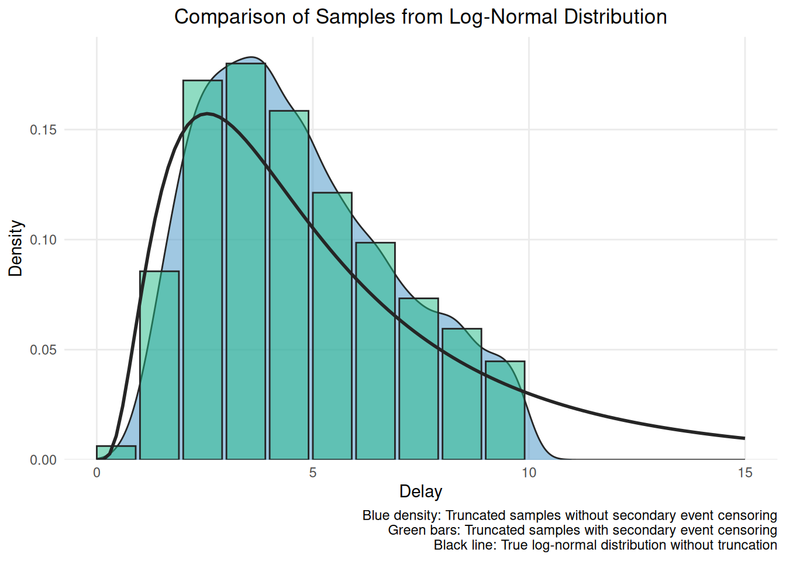
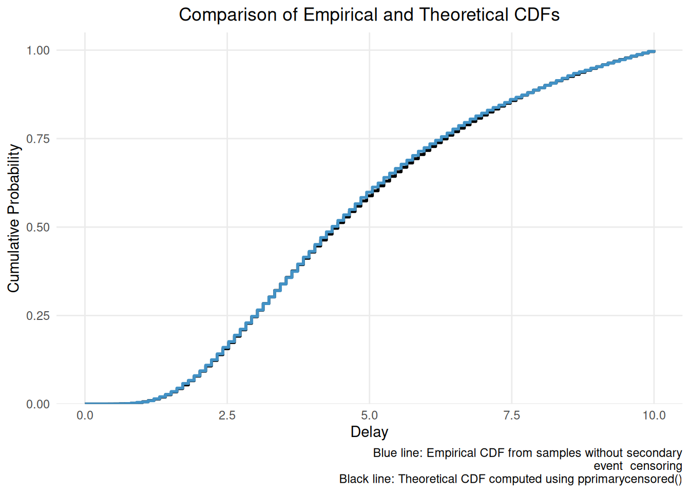

# Getting Started with primarycensored

## 1 Introduction

Delay distributions play a crucial role in various fields, including
epidemiology, reliability analysis, and survival analysis. These
distributions describe the time between two events of interest, such as
the incubation period of a disease or the time to failure of a
component. Accurately estimating and calculating these distributions is
essential for understanding the underlying processes and making informed
decisions^(\[[1](#ref-Charniga2024)\]). However, estimating these
distributions can be challenging due to various factors, including
censoring and truncation of the observed data^(\[[2](#ref-Park2024)\]).

The estimation of delay distributions often faces the following
challenges:

- **Primary event censoring**: The primary event (e.g., exposure to a
  pathogen or the start of a process) is often observed with some degree
  of interval censoring. This means that the exact time of the event is
  not known, but rather, it is known to have occurred within a certain
  time interval, commonly a day. As a result, any distribution based on
  these primary events is a combination of the underlying true
  distribution and the censoring distribution.

- **Truncation**: The observation of delay distributions is often
  conditioned on the occurrence of the secondary event. This leads to a
  truncation of the observed distribution, as delays longer than the
  observation time are not captured in the data. Consequently, the
  observed distribution is a combination of the underlying true
  distribution, the censoring distribution, and the observation time.

- **Secondary event censoring**: The secondary event (e.g., symptom
  onset or the end of a process) is also frequently observed with
  interval censoring. This additional layer of censoring further
  complicates the estimation of the delay distribution.

The `primarycensored` package aims to address these challenges by
providing tools to manipulate primary censored delay distributions and
to extend these distributions to account for both truncation and
secondary event censoring. By accounting for the censoring and
truncation present in the data, the package enables more accurate
estimation and use of the underlying true distribution.

In this vignette, we will provide a quick introduction to the main
functions and concepts in the `primarycensored` package. We will cover
the mathematical formulation of the problem, demonstrate the usage of
the key functions, and provide signposting on how to learn more.

## 2 Packages in this getting started vignette.

As well as the `primarycensored` package this vignette also uses
`ggplot2` for plotting.

``` r
# Load packages
library(primarycensored)
library(ggplot2)
# Set seed for reproducibility
set.seed(123)
```

## 3 Generating random samples with `rprimarycensored()`

This function generates random samples from a, potentially truncated,
primary event censored distribution. It adjusts the distribution by
accounting for the primary event distribution, potential truncation at a
maximum delay (\\D\\), and secondary event censoring.

The mathematical formulation for generating random samples from a
primary event censored distribution is as follows:

1.  Generate primary event times (\\p\\) from the specified primary
    event distribution (\\f_p\\) with parameters \\\phi\\, defined
    between 0 and the primary event window (\\pwindow\\):

\\p \sim f_p(\phi), \quad p \in \[0, pwindow\]\\

2.  Generate delays (\\d\\) from the specified delay distribution
    (\\f_d\\) with parameters \\\theta\\:

\\d \sim f_d(\theta), \quad d \geq 0\\

3.  Calculate the total delays (\\t\\) by adding the primary event times
    and the delays:

\\t = p + d\\

4.  Apply truncation (i.e. remove any delays that fall outside the
    observation window) to ensure that the delays are within the
    specified range \\\[0, D\]\\, where \\D\\ is the maximum observable
    delay:

\\t\_{truncated} = \\t \mid 0 \leq t \< D\\\\

5.  Round the truncated delays to the nearest secondary event window
    (\\swindow\\):

\\t\_{valid} = \lfloor \frac{t\_{truncated}}{swindow} \rfloor \times
swindow\\

Here’s an example of how to use
[`rprimarycensored()`](https://primarycensored.epinowcast.org/dev/reference/rprimarycensored.md)
to sample from a log-normal distribution with and without secondary
event interval censoring. For simplicity we will use a daily censoring
window for both events and assume a uniform primary event distribution.
However, the package supports any mix of censoring intervals and a wide
range of primary and delay distributions.

``` r
n <- 1e4
meanlog <- 1.5
sdlog <- 0.75
obs_time <- 10
pwindow <- 1

# Random samples without secondary event censoring
samples <- rprimarycensored(
  n,
  rdist = rlnorm, rprimary = runif,
  pwindow = pwindow, swindow = 0, D = obs_time,
  meanlog = meanlog, sdlog = sdlog
)
# Random samples with secondary event censoring
samples_sc <- rprimarycensored(
  n,
  rdist = rlnorm, rprimary = runif,
  pwindow = pwindow, swindow = 1, D = obs_time,
  meanlog = meanlog, sdlog = sdlog
)
# Calculate the PMF for the samples with secondary event censoring
samples_sc_pmf <- data.frame(
  pmf =
    table(samples_sc) /
      sum(table(samples_sc))
)
# Compare the samples with and without secondary event censoring
# to the true distribution
ggplot() +
  geom_density(
    data = data.frame(samples = samples),
    aes(x = samples),
    fill = "#4292C6",
    col = "#252525",
    alpha = 0.5
  ) +
  geom_col(
    data = samples_sc_pmf,
    aes(
      x = as.numeric(as.character(pmf.samples_sc)),
      y = pmf.Freq
    ),
    fill = "#20b986",
    col = "#252525",
    alpha = 0.5,
    width = 0.9,
    just = 0
  ) +
  geom_function(
    fun = dlnorm,
    args = list(meanlog = meanlog, sdlog = sdlog),
    color = "#252525",
    linewidth = 1
  ) +
  labs(
    title = "Comparison of Samples from Log-Normal Distribution",
    x = "Delay",
    y = "Density",
    caption = paste0(
      "Blue density: Truncated samples without secondary event censoring\n",
      "Green bars: Truncated samples with secondary event censoring\n",
      "Black line: True log-normal distribution without truncation"
    )
  ) +
  scale_x_continuous(limits = c(0, 15)) +
  scale_y_continuous(
    expand = expansion(mult = c(0, 0.05))
  ) +
  theme_minimal() +
  theme(
    panel.grid.minor = element_blank(),
    plot.title = element_text(hjust = 0.5)
  )
```



Neither distribution matches the true distribution due to the truncation
at `D` which biases both observed distributions towards shorter delays,
as well as the primary and secondary event censoring.

## 4 Compute the primary event censored cumulative distribution function (CDF) for delays with `pprimarycensored()`

This function computes the primary event censored cumulative
distribution function (CDF) for a given set of quantiles. It adjusts the
CDF of delay distribution by accounting for the primary event
distribution and potential truncation at a maximum delay (\\D\\). This
is useful when we want to understand the probability that a delay will
be less than or equal to a certain value, taking into account both the
primary event distribution and any truncation in our data.

The primary event censored CDF, (\\F\_{\text{cens}}(q)\\), is given by:

\\ F\_{\text{cens}}(q) = \int\_{0}^{pwindow} F(q - p) \cdot
f\_{\text{primary}}(p) \\ dp \\

where \\F\\ is the CDF of the delay distribution,
\\f\_{\text{primary}}\\ is the PDF of the primary event times, and
\\pwindow\\ is the primary event window.

If the maximum delay \\D\\ is finite, the CDF is normalized by dividing
by \\F\_{\text{cens}}(D)\\:

\\ F\_{\text{cens,norm}}(q) =
\frac{F\_{\text{cens}}(q)}{F\_{\text{cens}}(D)} \\

where \\F\_{\text{cens,norm}}(q)\\ is the normalized CDF.

Let’s compare the empirical CDF of our samples without secondary event
censoring to the theoretical CDF computed using
[`pprimarycensored()`](https://primarycensored.epinowcast.org/dev/reference/pprimarycensored.md):

``` r
empirical_cdf <- ecdf(samples)
theoretical_cdf <- pprimarycensored(
  seq(0, obs_time, length.out = 100),
  pdist = plnorm, dprimary = dunif,
  pwindow = pwindow, D = obs_time,
  meanlog = meanlog, sdlog = sdlog
)

# Create a data frame for plotting
cdf_data <- data.frame(
  x = seq(0, obs_time, length.out = 100),
  Theoretical = theoretical_cdf,
  Empirical = empirical_cdf(seq(0, obs_time, length.out = 100))
)

# Plot the empirical and theoretical CDFs
ggplot(cdf_data, aes(x = x)) +
  geom_step(aes(y = Theoretical), color = "black", linewidth = 1) +
  geom_step(aes(y = Empirical), color = "#4292C6", linewidth = 1) +
  labs(
    title = "Comparison of Empirical and Theoretical CDFs",
    x = "Delay",
    y = "Cumulative Probability",
    caption = paste0(
      "Blue line: Empirical CDF from samples without secondary
       event  censoring\n",
      "Black line: Theoretical CDF computed using pprimarycensored()"
    )
  ) +
  scale_y_continuous(expand = expansion(mult = c(0, 0.05))) +
  theme_minimal() +
  theme(
    panel.grid.minor = element_blank(),
    plot.title = element_text(hjust = 0.5)
  )
```



The theoretical CDF matches the empirical CDF very well, confirming that
[`pprimarycensored()`](https://primarycensored.epinowcast.org/dev/reference/pprimarycensored.md)
is working as expected.

## 5 Compute the primary event censored probability mass function (PMF) with `dprimarycensored()`

This function computes the primary event censored probability mass
function (PMF) for a given set of quantiles using the CDF. On top of
accounting for the primary event distribution and truncation, it also
adjusts for secondary event censoring. This is particularly useful when
working with discrete data or when we want to understand the probability
of observing delays in specific time windows, such as daily reporting
delays.

The primary event censored PMF, (\\f\_{\text{cens}}(d)\\), is given by:

\\ f\_{\text{cens}}(d) = F\_{\text{cens}}(d + \text{swindow}) -
F\_{\text{cens}}(d) \\

where (\\F\_{\text{cens}}\\) is the potentially right truncated primary
event censored CDF and (\\\text{swindow}\\) is the secondary event
window.

Let’s compare the empirical PMF of our samples with secondary event
censoring to the theoretical PMF computed using
[`dprimarycensored()`](https://primarycensored.epinowcast.org/dev/reference/dprimarycensored.md):

``` r
# Calculate the theoretical PMF using dprimarycensored
theoretical_pmf <- dprimarycensored(
  0:(obs_time - 1),
  pdist = plnorm, dprimary = dunif,
  pwindow = pwindow, swindow = 1, D = obs_time,
  meanlog = meanlog, sdlog = sdlog
)

pmf_df <- data.frame(
  x = 0:obs_time,
  pmf = c(theoretical_pmf, 0)
)

# Plot the empirical and theoretical PMFs
ggplot() +
  geom_col(
    data = samples_sc_pmf,
    aes(
      x = as.numeric(as.character(pmf.samples_sc)),
      y = pmf.Freq
    ),
    fill = "#20b986",
    col = "#252525",
    alpha = 0.5,
    width = 0.9,
    just = 0
  ) +
  geom_step(
    data = pmf_df,
    aes(x = x, y = pmf),
    color = "black",
    linewidth = 1
  ) +
  labs(
    title = "Comparison of Samples from Log-Normal Distribution",
    x = "Delay",
    y = "Density",
    caption = paste0(
      "Green bars: Empirical PMF from samples with secondary event censoring\n",
      "Black line: Theoretical PMF computed using dprimarycensored()"
    )
  ) +
  scale_y_continuous(expand = expansion(mult = c(0, 0.05))) +
  theme_minimal() +
  theme(
    panel.grid.minor = element_blank(),
    plot.title = element_text(hjust = 0.5)
  )
```


Again the theoretical PMF matches the empirical PMF very well,
confirming that
[`dprimarycensored()`](https://primarycensored.epinowcast.org/dev/reference/dprimarycensored.md)
is also working as expected.

## 6 Other key functionality

In addition to these main functions, the package also includes:

- **Primary event distributions:** The package includes commonly used
  primary event distributions such as exponential growth.

- **Built-in estimation tools:** The package provides functionality to
  estimate delay distributions from censored and truncated data using
  both Stan and `fitdistrplus`. These tools make it easy to fit models
  without having to implement the likelihood functions yourself.

- **Analytical solutions:** For common combinations of primary event and
  delay distributions (e.g., uniform primary events with gamma,
  lognormal, or Weibull delays), the package includes analytical
  solutions that provide significant computational speedups compared to
  numerical integration.

- **Stan versions of all functions and R functions to interface with
  Stan:** All R functions have a corresponding Stan function. These Stan
  functions are used in the estimation of delay distributions using the
  Stan software. The package also includes tools to manipulate the Stan
  code in R.

## 7 Learning more

- For more on `primarycensored` see the other package vignettes and the
  function documentation.
- For a more detailed explanation of the mathematical formulation of the
  primary event censored distribution see the
  [`vignette("why-it-works")`](https://primarycensored.epinowcast.org/dev/articles/why-it-works.md).
- For more mathematical details on the analytic solutions see the
  [`vignette("analytic-solutions")`](https://primarycensored.epinowcast.org/dev/articles/analytic-solutions.md).
- For more methodological background on delay distributions see Park et
  al.^(\[[2](#ref-Park2024)\]).
- For advice on best practices when estimating or handling delay
  distributions see Charniga et al.^(\[[1](#ref-Charniga2024)\]).

1\.

Charniga, K., Park, S. W., Akhmetzhanov, A. R., Cori, A., Dushoff, J.,
Funk, S., Gostic, K. M., Linton, N. M., Lison, A., Overton, C. E.,
Pulliam, J. R. C., Ward, T., Cauchemez, S., & Abbott, S. (2024). Best
practices for estimating and reporting epidemiological delay
distributions of infectious diseases. *PLoS Comput. Biol.*, *20*(10),
e1012520. <https://doi.org/10.1371/journal.pcbi.1012520>

2\.

Park, S. W., Akhmetzhanov, A. R., Charniga, K., Cori, A., Davies, N. G.,
Dushoff, J., Funk, S., Gostic, K., Grenfell, B., Linton, N. M.,
Lipsitch, M., Lison, A., Overton, C. E., Ward, T., & Abbott, S. (2024).
Estimating epidemiological delay distributions for infectious diseases.
*bioRxiv*. <https://doi.org/10.1101/2024.01.12.24301247>
